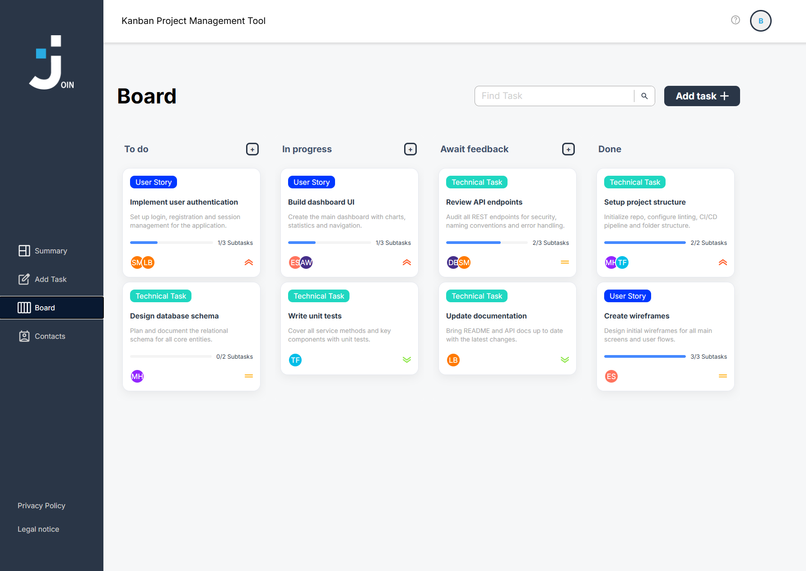

# 📋 Join

A Kanban-inspired task manager for creating and organizing tasks with drag and drop functionality.

👉 **[Open the app](https://benjaminblarr.dev/join/#/login)**



## 📌 About
Join is a collaborative task management app built by a team of four. It allows users to create, organize and manage tasks using a Kanban board system – including drag and drop, user assignments and category management.

## ✨ Features
- Kanban board with drag and drop functionality
- Create, edit and delete tasks
- Assign tasks to users and categories
- Clean and responsive UI

## 🛠️ Technologies


## 👥 Team
Developed in collaboration as a group project with a team of 4 developers.

---

## 🚀 Getting Started

This project was generated using [Angular CLI](https://github.com/angular/angular-cli) version 20.3.5.

### Development server

To start a local development server, run:

```bash
ng serve
```

Once the server is running, open your browser and navigate to `http://localhost:4200/`. The application will automatically reload whenever you modify any of the source files.

### Code scaffolding

```bash
ng generate component component-name
```

### Building

```bash
ng build
```

### Running unit tests

```bash
ng test
```

For more information visit the [Angular CLI Overview and Command Reference](https://angular.dev/tools/cli) page.
