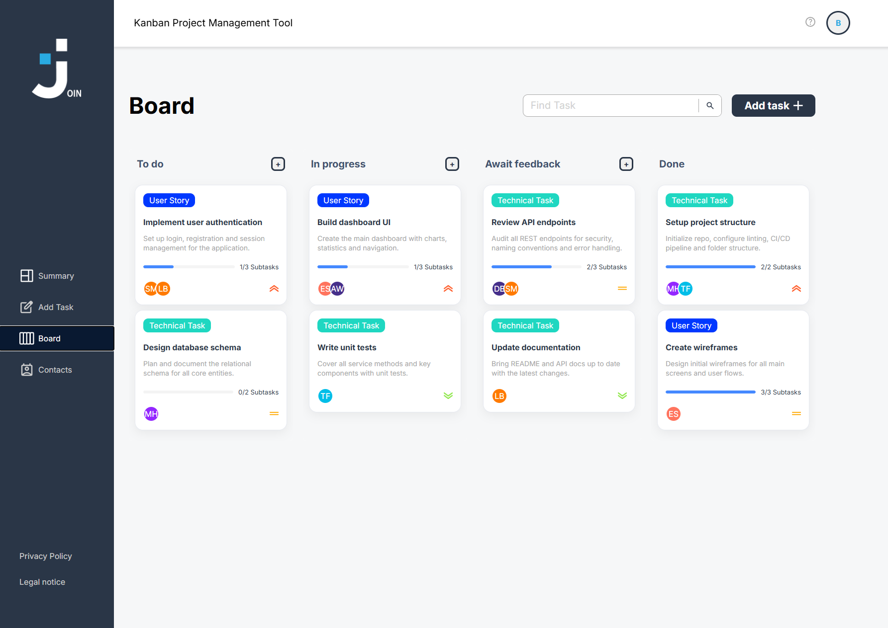

# Join

A Kanban-inspired task manager for creating and organizing tasks with drag and
drop.

👉 **[Open the app](https://benjaminblarr.de/join/)**



## About

Join lets users create tasks, sort them into the four columns of a Kanban
board, assign them to contacts and move them by dragging. Tasks, contacts and
accounts live in Supabase, so the board looks the same on every device and
survives a logout.

Built as a group project with four developers over roughly eight weeks. I
worked across the whole application rather than owning a single area, from the
board and the task forms through to the contact management and the responsive
layout.

## Features

- Kanban board with drag and drop across four columns
- Create, edit and delete tasks with subtasks, priority and due date
- Contact management, tasks assigned to one or more contacts
- Sign up, log in and a guest login
- Responsive down to mobile, with a separate layout for narrow screens

## Built with

**Frontend**

<p align="left">
  
  
  
  
  
</p>

**Backend**

<p align="left">
  
</p>

Supabase handles authentication and stores tasks and contacts.

## Getting Started

```bash
npm install
ng serve
```

The app is then available at `http://localhost:4200/`.

Built with Angular CLI 20.3.5.
